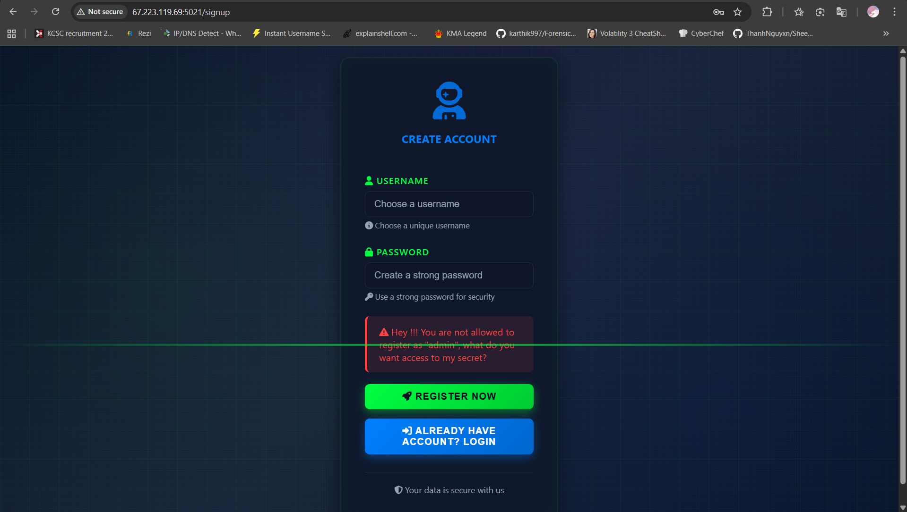
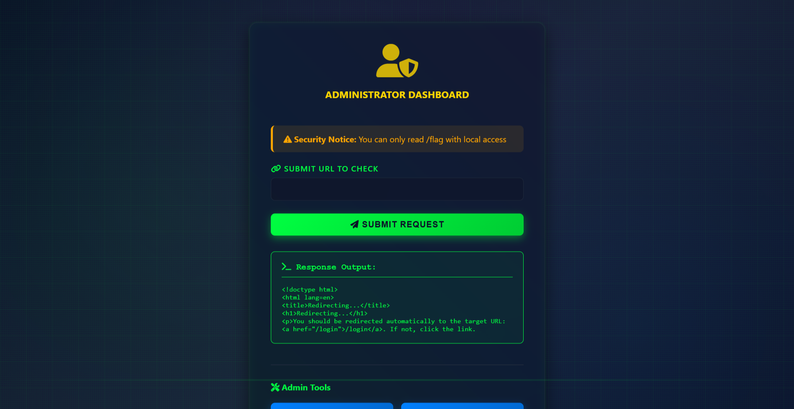

# Description

> A simple website covers some secrets. You must login as admin user. But how can you do that?
> 
> Hint: unicode normalize
> 
> Author: l1nx1n

# TL;DR

Chall này yêu cầu mình tìm các đăng nhập vào tài khoản `admin` sau đó tìm cách để đọc được để truy cập được vào enpoint `/flag` bằng cách bypass bộ lọc

# Solution

Đây là giao diện khi ta mới mở trang web lên

Thử đăng kí với `username` là `admin` thì mình ngay lập tức bị chặn

Dựa vào hint của tác giả mình nghĩ ngay tới kịch bản tạo tài khoản mới với `username` na ná `admin` nhưng sẽ đổi một kí tự sang bảng mã khác

Mục đích ban đầu của mình là tạo một tài khoản tương tự `admin` để vượt qua phần login sau đó cầu mong tất cả những hàm kiểm tra bên trong đều sẽ normalize username của mình

Ở đây mình thay kí tự a trong `admin` thành ａ

Đăng kí thành công và khi đăng nhập lại bằng `admin` bình thường thì mình đăng nhập được -> chứng tỏ là nó đã vượt qua phần kiểm tra admin và khi cập nhật lên database thì được normalize và ghi đè lên `admin` cũ

Mình có thử ghé qua endpoint `/flag` thì nhận được một response duy nhất là 

`Only local access allowed`

Sau đấy mình thấy giao diện ở `/admin` yêu cầu nhập url để check cộng với response vừa rồi thì mình tiến hành thử điền endpoint đó vào ô nhưng đổi thành `localhost` xem sao

`You can not access the flag directly`

Không vào được `/flag` mình thử tiếp `/admin` 

Sau đấy đoạn này mình bí... mình thử fuzzing một hồi lâu thì tất cả những gì mình thu được là nó sẽ fetch nội dung của url mà mình điền vào và hiển thị lên màn hình

Về sau thì mình có nhờ thêm AI gen cho mình một đống thứ để fuzzing nữa thì cuối cùng cũng có một cái hoạt động

`http://localhost/flag?`

Thế là tự dưng mình có flag ?:vv 

Hỏi thử anh chị trong ban ra đề thì hình như có một cách nào đấy để mình xem được phần nó filter input ra sao nhưng mò mãi mà mình vẫn không tìm ra O_O

**Flag**: `KCSC{Y0u_kn0w_uRl_Globbing}`